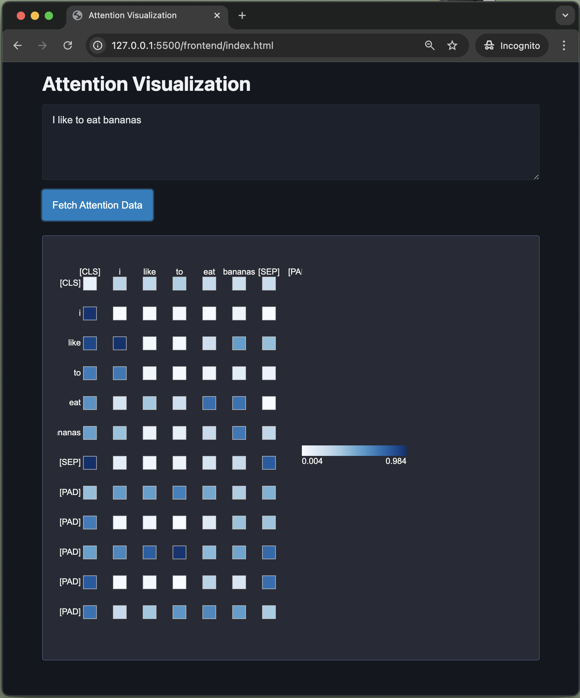

# Interactive Attention Visualization

Visualize attention matrices from DistilBERT.
It performs inference, caches outputs, and renders an interactive D3.js heatmap with tooltips.

## Setup

1. **Backend:**

   - Install dependencies:
     `pip install flask flask-cors torch transformers`
   - Run the Flask app:
     `python backend/app.py`

2. **Frontend:**
   - Open `index.html` in a browser (served at `http://127.0.0.1:5500`) - use live server.

Enjoy exploring attention data!
